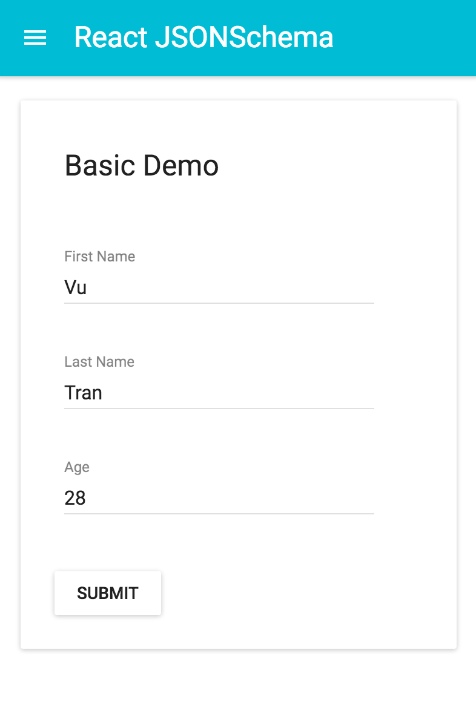

# React JSONSchema

> Create beautiful forms with [JSONSchema](http://json-schema.org)
> Inspired by [react-jsonschema-form](https://github.com/mozilla-services/react-jsonschema-form) from Mozilla.



## Installation

````bash
$ npm install --save react-jsonschema
````

## Usage

````js
import Form from 'react-jsonschema';

const schema = {
  "title": "Basic Demo",
  "type": "object",
  "properties": {
    "firstName": {
      "type": "string",
      "title": "First Name",
    },
    "lastName": {
      "type": "string",
      "title": "Last Name",
    },
    "age": {
      "type": "integer",
      "title": "Age",
      "description": "Age in years",
    },
  },
};

const formData = {
  firstName: '',
  lastName: '',
  age: '',
};


ReactDOM.render(
  <Form
    schema={schema}
    formData={formData}
    onError={errors => {
      console.log(errors);
    }}
    onSubmit={data => {
      console.log(data);
    }}
  />,
  document.getElementById('app'),
);
````

### Lint

````bash
$ npm run lint
````

### Dev

````bash
$ npm run dev
````

### Build

````bash
$ npm run build
````

## References

- [JSON Schema](http://json-schema.org/)

## License

MIT © [Vu Tran](https://github.com/vutran/)
